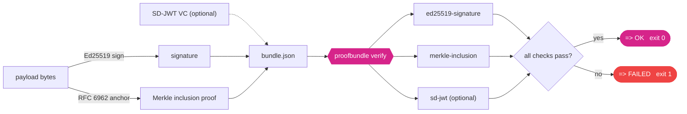

<div align="center">

<picture>
  <source media="(prefers-color-scheme: dark)" srcset="assets/b7n0de-logo-dark.svg">
  
</picture>

<h1>proofbundle</h1>

**Emit and verify, fully offline, portable evidence that a piece of data was
signed and anchored in a tamper-evident log — and optionally carries a
selectively disclosable credential. Pure Python, no server, no daemon, one JSON file.**

[](https://github.com/b7n0de/proofbundle/actions/workflows/ci.yml)
[](https://pypi.org/project/proofbundle/)
[](https://pypi.org/project/proofbundle/)
[](LICENSE)
[](https://github.com/astral-sh/ruff)
[](https://slsa.dev)

</div>

**At a glance:** `proofbundle emit` signs and anchors a payload; `proofbundle
verify` checks one self-contained `bundle.json` with three offline cryptographic
checks → `OK` or `FAILED`. No network, no daemon, no own crypto. 62 tests.

## Contents

- [Why](#why)
- [What it verifies](#what-it-verifies)
- [How it fits together](#how-it-fits-together)
- [Install](#install)
- [Quickstart](#quickstart)
- [Interoperability](#interoperability)
- [Bundle format](#bundle-format-proofbundlev01)
- [Eval receipts](#eval-receipts)
- [Security notes and scope](#security-notes-and-scope-stated-honestly)
- [Roadmap](#roadmap)
- [Contributing](#contributing)
- [License](#license)

## Why

Cryptographic evidence today usually needs a running service to check it.
Sigstore Rekor, Certificate Transparency and other transparency logs are
excellent, but verifying an inclusion proof normally means talking to a log
server or wiring up Go tooling. There is no small, portable, Python-native
verifier that takes one self-contained file and answers a simple question
offline:

*Were these exact bytes signed by this key, and anchored under this Merkle root,
yes or no.*

`proofbundle` is that verifier — and, since v0.2, the matching emitter. It is
the verification half of a larger idea: turning a reproducible result (for
example an AI evaluation run) into a signed, third-party-verifiable, selectively
disclosable receipt. The verifier shipped first, small and correct, so it could
be reviewed and trusted on its own; `emit_bundle` now creates bundles that
`verify_bundle` accepts, fully offline on both sides.

## What it verifies

A bundle is a single JSON document. `proofbundle` checks, offline:

1. **ed25519-signature** — the payload was signed by the stated Ed25519 key
2. **merkle-inclusion** — the payload is anchored under the stated tree root,
   using an RFC 6962 / RFC 9162 inclusion proof (the same primitive as Rekor and
   Certificate Transparency)
3. **sd-jwt** (optional) — an embedded SD-JWT selective-disclosure credential is
   well formed, and if an issuer key is given, correctly issuer-signed

The verifier treats the payload as opaque bytes. It proves that these exact
bytes were signed and anchored, not what they mean. That is on purpose: it keeps
the trusted core tiny.

## How it fits together



## Install

```bash
pip install proofbundle
```

Requires Python 3.9+ and [`cryptography`](https://cryptography.io). Signature
math is delegated to `cryptography`; this project never rolls its own crypto.
The Merkle and SD-JWT logic is pure standard library.

SD-JWT support is an optional extra (it adds no runtime dependency beyond the
core `cryptography`, so the trusted core stays lean):

```bash
pip install "proofbundle[sdjwt]"
```

## Quickstart

```bash
# generate a real example bundle with throwaway keys
python examples/make_example.py

# verify it
proofbundle verify examples/example_bundle.json
```

<div align="center">

</div>

Machine-readable output and a non-zero exit code on failure:

```bash
proofbundle verify --json bundle.json   # exit 0 = ok, 1 = failed, 2 = malformed
```

Emit a bundle of your own (v0.2): sign a payload with a fresh key and anchor it,
then verify it anywhere, offline.

```bash
proofbundle emit --payload-file result.json --new-key signer.key --out bundle.json
proofbundle verify bundle.json
```

Library use:

```python
from proofbundle import verify_bundle

result = verify_bundle("bundle.json")
print(result.ok)          # True / False
for check in result.checks:
    print(check.name, check.ok, check.detail)
```

Verify a consistency proof between two log states directly:

```python
from proofbundle import verify_consistency
verify_consistency(first_size, second_size, proof, first_root, second_root)  # -> bool
```

## Interoperability

proofbundle uses the same RFC 6962 / RFC 9162 Merkle primitive as
[Sigstore Rekor](https://docs.sigstore.dev/) and Certificate Transparency, so its
`verify_inclusion` checks a real proof from a live transparency log, not just its
own bundles. [`examples/rekor_interop.py`](examples/rekor_interop.py) verifies a
real Sigstore Rekor inclusion proof (a committed fixture, `logIndex` 25579 in a
4.16-million-entry tree) **fully offline**, and documents the field mapping from
the Rekor bundle and its C2SP `tlog-checkpoint` signed note to proofbundle's
`merkle` object. Correctness is also checked against external RFC 6962 test
vectors vendored from
[transparency-dev/merkle](https://github.com/transparency-dev/merkle) (see
`tests/fixtures/`), plus Hypothesis property tests.

## Bundle format (`proofbundle/v0.1`)

The format is specified normatively in [SPEC.md](SPEC.md) (fields, encodings,
RFC 6962 hashing, verification order) with a machine-readable JSON Schema at
[`schemas/proofbundle_v0_1.schema.json`](schemas/proofbundle_v0_1.schema.json).

```json
{
  "schema": "proofbundle/v0.1",
  "payload_b64": "<the exact bytes that were signed and anchored>",
  "signature": { "alg": "ed25519", "public_key_b64": "...", "sig_b64": "..." },
  "merkle": {
    "hash_alg": "sha256-rfc6962",
    "leaf_index": 1,
    "tree_size": 4,
    "inclusion_proof_b64": ["...", "..."],
    "root_b64": "..."
  },
  "sd_jwt_vc": { "compact": "<sd-jwt>", "issuer_public_key_b64": "..." }
}
```

`sd_jwt_vc` is optional. Base64 fields are standard base64; the SD-JWT compact
string uses base64url as per the spec.

## Security notes and scope, stated honestly

The scope is deliberately narrow. It does exactly what it says and no more:

- Ed25519 signatures only, for both the payload and the optional SD-JWT issuer
  signature.
- SD-JWT: the SD-JWT core is now [RFC 9901](https://datatracker.ietf.org/doc/rfc9901/)
  (November 2025); this verifies that every presented disclosure is committed in the
  issuer-signed payload, and the issuer signature (EdDSA) if a key is supplied. It
  does **not** verify a Key Binding JWT, an X.509 or trust-list chain, status
  lists, or `vct` type metadata. **SD-JWT VC** (the credential-type profile) is
  still an IETF draft ([draft-ietf-oauth-sd-jwt-vc](https://datatracker.ietf.org/doc/draft-ietf-oauth-sd-jwt-vc/));
  full VC conformance is on the roadmap.
- The verifier does not fetch anything. Trust anchors (the signer key, the
  expected root) are inputs you supply out of band.
- No custom cryptography. Ed25519 comes from `cryptography`; Merkle hashing is
  RFC 6962.

If you find a correctness or security issue, please open an issue or see
[SECURITY.md](SECURITY.md).

## Eval receipts

Since v0.4, proofbundle turns a reproducible eval run into a signed, Merkle-anchored
**receipt** that proves *suite S `comparator` threshold T, passed* while carrying only
**salted commitments** to the model and dataset identifiers — never the weights, the
data, or the plaintext names. A third party verifies the threshold was met, offline,
from one file, without ever seeing the model or the test set.

```bash
pip install "proofbundle[eval]"          # emit side needs an RFC 8785 canonicalizer
proofbundle emit-eval --claim claim.json --out receipt.json --new-key signer.key
proofbundle verify receipt.json          # a receipt is a normal bundle
proofbundle show-eval receipt.json       # verify + print the claim (issuer-bound)
```

The claim format is specified in [EVAL_CLAIM.md](EVAL_CLAIM.md); the emit path uses
RFC 8785 JCS canonicalization, the verify path stays dependency-free. **Honest scope:**
a receipt proves `passed` against `threshold` and hides the model/dataset via salted
commitments — it does **not** prove the evaluation was well designed or that the score
itself is correct. Those are human judgements; what it removes is the need to simply
trust the number.

### Since v0.5: framework adapter, in-toto, selective disclosure

- **inspect_ai adapter** (`pip install "proofbundle[inspect]"`) reads a UK AISI
  [inspect_ai](https://github.com/UKGovernmentBEIS/inspect_ai) eval log via the stable
  `read_eval_log` API (lazy import; the core stays dependency-free) and maps it to a claim.
  `proofbundle.adapters.from_lm_eval_results` reads lm-evaluation-harness `results.json`
  without importing anything.
- **in-toto Statement v1** — `proofbundle.intoto.to_intoto_statement(claim, root_b64=…)`
  emits the receipt as an in-toto statement with a self-hosted predicate type. The subject
  digest is an *honest salted commitment* under a custom key, never `sha256` (see
  [PREDICATE.md](PREDICATE.md)).
- **SD-JWT issuance** (RFC 9901) — `proofbundle.sdjwt_issue.issue_sd_jwt(claim, signer,
  root_b64=…, exact_score=…)` issues the receipt so a holder can disclose `passed` +
  `threshold` while **withholding the exact score** and the identifier openings. The signed
  bundle payload is the source of truth; the SD-JWT is a derived, bundle-bound view, verified
  by proofbundle's own verifier **and** the `sd-jwt-python` reference.

## Roadmap

- **v0.1** — the offline verifier plus a real example bundle.
- **v0.2** — the emitter: `emit_bundle` / `proofbundle emit`.
- **v0.3** — external RFC 6962 conformance vectors + real Sigstore Rekor interop.
- **v0.4** — the eval-receipt emitter (`emit_eval_receipt` / `proofbundle emit-eval`),
  salted commitments, issuer binding.
- **v0.5 (current release)** — inspect_ai adapter (stable API), in-toto Statement v1 view,
  and SD-JWT **issuance** per RFC 9901 (selective disclosure of the exact score).
- **Deferred** (explicitly not yet built) — SD-JWT VC conformance + `vct` metadata,
  Key-Binding JWT, status lists / revocation, an official in-toto PR, DSSE / a full in-toto client.

## Contributing

See [CONTRIBUTING.md](CONTRIBUTING.md) and the
[Code of Conduct](CODE_OF_CONDUCT.md). Good first issues are labeled
[`good-first-issue`](https://github.com/b7n0de/proofbundle/labels/good-first-issue).
The verifier core aims to stay small, dependency-light and correct.

## License

MIT, see [LICENSE](LICENSE).

---

<p align="center"><sub>proofbundle is part of <b>b7n0de</b>, Verified AI Work &middot; <a href="https://b7n0de.com">b7n0de.com</a></sub></p>
