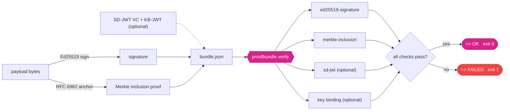
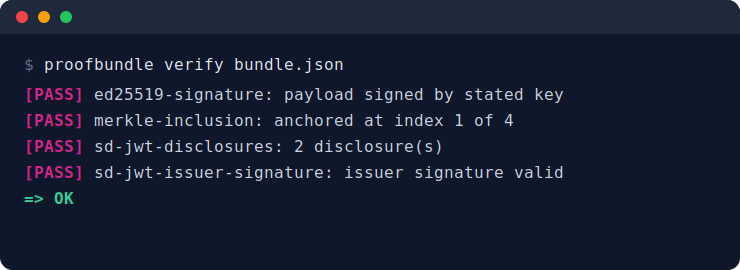
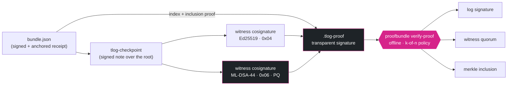

<div align="center">

<picture>
  <source media="(prefers-color-scheme: dark)" srcset="assets/b7n0de-logo-dark.svg">
  
</picture>

<h1>proofbundle</h1>

**An offline verifier for AI eval receipts. Standards-native: Ed25519 signature,
RFC 6962 transparency-log Merkle anchoring, C2SP witnessed checkpoints and
`.tlog-proof` transparent signatures (post-quantum-ready witnesses, ML-DSA-44),
SD-JWT (RFC 9901) selective disclosure with Key Binding, Token-Status-List
revocation snapshots, aligned to the in-toto test-result predicate. One portable
file, no server, no network.**

[](https://github.com/b7n0de/proofbundle/actions/workflows/ci.yml)
[](https://pypi.org/project/proofbundle/)
[](https://pypi.org/project/proofbundle/)
[](https://pepy.tech/project/proofbundle)
[](LICENSE)
[](https://github.com/astral-sh/ruff)
[](https://slsa.dev)
[-D6248A.svg)](https://pypi.org/project/proofbundle/)
[](https://github.com/C2SP/C2SP/blob/main/tlog-cosignature.md)
[](scripts/mutation_check.py)
[](https://github.com/C2SP/C2SP/blob/main/tlog-proof.md)
<!-- DOI badge placeholder: enable Zenodo archiving for this repo, then add the Zenodo concept-DOI
     badge here (and the DOI to CITATION.cff) once Zenodo assigns one on the next release. No DOI has
     been assigned yet (no archived record exists at build time) — tracked in the human checklist. -->

</div>

**At a glance:** `proofbundle emit` signs and anchors a payload; `proofbundle
verify` checks one self-contained `bundle.json` with three offline cryptographic
checks → `OK` or `FAILED`. No network, no daemon, no own crypto. 209 tests + a CI mutation gate.

## Contents

- [Why](#why)
- [What a receipt proves](#what-a-receipt-proves-and-what-it-does-not)
- [What it verifies](#what-it-verifies)
- [How it fits together](#how-it-fits-together)
- [Install](#install)
- [Quickstart](#quickstart)
- [Demo](#demo--a-real-eval-log-to-a-verified-receipt-offline)
- [Integrations](#integrations--a-signed-receipt-of-your-eval-or-test-run-automatically-v10)
- [Interoperability](#interoperability)
- [Bundle format](#bundle-format-proofbundlev01)
- [Eval receipts](#eval-receipts)
- [Security notes and scope](#security-notes-and-scope-stated-honestly)
- [Compliance](#compliance)
- [Roadmap](#roadmap)
- [Contributing](#contributing)
- [License](#license)

## Why

Cryptographic evidence today usually needs a running service to check it.
Sigstore Rekor, Certificate Transparency and other transparency logs are
excellent, but verifying an inclusion proof normally means talking to a log
server or wiring up Go tooling. There is no small, portable, Python-native
verifier that takes one self-contained file and answers a simple question
offline:

*Were these exact bytes signed by this key, and anchored under this Merkle root,
yes or no.*

`proofbundle` is that verifier — and, since v0.2, the matching emitter. It is
the verification half of a larger idea: turning a reproducible result (for
example an AI evaluation run) into a signed, third-party-verifiable, selectively
disclosable receipt. The verifier shipped first, small and correct, so it could
be reviewed and trusted on its own; `emit_bundle` now creates bundles that
`verify_bundle` accepts, fully offline on both sides.

## What a receipt proves (and what it does not)

A receipt is a **tamper-evident, signed statement of authorship and integrity** over an eval or test result —
not a proof that the number is *true* or that the evaluation was well designed. Hold these apart:

- **It proves:** the payload was signed by the stated issuer (authorship), no byte changed since (integrity,
  Ed25519 + RFC 6962), the model/dataset behind salted commitments, and — since v1.1 — the **assurance level**
  is signed in — tamper-evident and bound to the issuer, so a third party cannot alter it. `show-eval`
  displays the level, warns on the weakest combination (self_attested with no pre-registration), and shows
  withheld SD-JWT fields + receipt age; the `verify_commitment` library call (the holder presents the
  identifier + salt out of band) makes a model-swap visible.
- **It does not prove:** that a *self-attested* issuer is honest. The level is issuer-DECLARED: a dishonest
  issuer can sign `reproduced` on a self-run eval — the signature binds *who claimed it* to them, it does not
  make the claim true (same as the score). The warning catches the honest self_attested case; a higher level
  is only as trustworthy as the process behind it.
- **Also not proven:** that a result was not cherry-picked from many runs without pre-registration, or that
  the suite measures what it claims. Those need a pre-registered protocol or independent reproduction.

| assurance_level | meaning |
|---|---|
| `self_attested` | issuer ran + signed it (default); trust rests on the issuer |
| `third_party` | a third party checked before signing |
| `reproduced` | independently re-run and matched |
| `enclave_attested` | produced in an attested trusted execution environment |

Full detail: **[THREAT_MODEL.md](THREAT_MODEL.md)** — what `verify` catches and what it structurally cannot.

## What it verifies

A bundle is a single JSON document. `proofbundle` checks, offline:

1. **ed25519-signature** — the payload was signed by the stated Ed25519 key
2. **merkle-inclusion** — the payload is anchored under the stated tree root,
   using an RFC 6962 / RFC 9162 inclusion proof (the same primitive as Rekor and
   Certificate Transparency)
3. **sd-jwt** (optional) — an embedded SD-JWT selective-disclosure credential is
   well formed, and if an issuer key is given, correctly issuer-signed
4. **sd-jwt-key-binding** (optional, v1.2; hardened v1.3) — proof-of-possession, **fail-closed**.
   The check runs only once the issuer signature itself verified (an unauthenticated SD-JWT can
   never report a valid holder binding). Then: `typ` is `kb+jwt`, `iat`/`aud`/`nonce`/`sd_hash` are
   present, `sd_hash` binds the exact presented disclosure set, and the signature verifies under the
   issuer-bound `cnf.jwk` holder key. A present-but-broken KB-JWT fails the bundle; and if the issuer
   **bound** a `cnf` holder key but the presentation carries **no** KB-JWT, that fails too — stripping
   the binding is a bearer downgrade, not a valid receipt. `verify --aud/--nonce` enforce RFC 9901
   §7.3 audience/replay binding when the relying party supplies them.

Beyond the single-file bundle, the library also verifies, all offline: a **witnessed C2SP checkpoint**
(`verify_witnessed_checkpoint`, Ed25519 + post-quantum ML-DSA-44 cosignatures — the quorum counts distinct
witness **keys**, not names, so one key under many names can never stuff a threshold), a **C2SP
`.tlog-proof`** (`proofbundle verify-proof`), and a **Token Status List** revocation snapshot.

The verifier treats the payload as opaque bytes. It proves that these exact
bytes were signed and anchored, not what they mean. That is on purpose: it keeps
the trusted core tiny.

## How it fits together



## Install

```bash
pip install proofbundle
```

Requires Python 3.10+ and [`cryptography`](https://cryptography.io). Signature
math is delegated to `cryptography`; this project never rolls its own crypto.
The Merkle and SD-JWT logic is pure standard library.

SD-JWT support is an optional extra (it adds no runtime dependency beyond the
core `cryptography`, so the trusted core stays lean):

```bash
pip install "proofbundle[sdjwt]"
```

## Quickstart

```bash
# generate a real example bundle with throwaway keys
python examples/make_example.py

# verify it
proofbundle verify examples/example_bundle.json
```

<div align="center">

</div>

Machine-readable output and a non-zero exit code on failure:

```bash
proofbundle verify --json bundle.json   # exit 0 = ok, 1 = failed, 2 = malformed
```

Debugging an inclusion proof (v1.2): `--verbose` prints the recomputed Merkle
root next to the stated root, so a `FAIL` shows *which* root your payload
actually anchors to:

```bash
proofbundle verify --verbose bundle.json
```

Emit a bundle of your own (v0.2): sign a payload with a fresh key and anchor it,
then verify it anywhere, offline.

```bash
proofbundle emit --payload-file result.json --new-key signer.key --out bundle.json
proofbundle verify bundle.json
```

Library use:

```python
from proofbundle import verify_bundle

result = verify_bundle("bundle.json")
print(result.ok)          # True / False
for check in result.checks:
    print(check.name, check.ok, check.detail)
```

Verify a consistency proof between two log states directly:

```python
from proofbundle import verify_consistency
verify_consistency(first_size, second_size, proof, first_root, second_root)  # -> bool
```

## Demo — a real eval log to a verified receipt, offline

```bash
pip install "proofbundle[eval,inspect]"
make demo          # or: bash scripts/demo.sh
```

`make demo` runs end-to-end with **no network, no API key, no GPU**: it takes genuine eval logs — an
inspect_ai `mockllm/model` `.eval` log and an lm-evaluation-harness `--model dummy` `results.json`
(committed under `tests/fixtures/`, generated offline) — turns each into a signed, Merkle-anchored
proofbundle receipt, and verifies it to `=> OK`. The scores are random (a dummy model); the point is
that the *artifact* is signed and offline-verifiable, with model and dataset kept as salted commitments.
See [`examples/inspect_receipt.py`](examples/inspect_receipt.py) and
[`examples/lm_eval_receipt.py`](examples/lm_eval_receipt.py).

## Integrations — a signed receipt of your eval or test run, automatically (v1.0)

Since v1.0, proofbundle can **auto-emit** a signed receipt of an **inspect_ai eval** or a **pytest run** via
each framework's native plugin API — installed and ready, but strictly **opt-in** (it emits only when you set
`PROOFBUNDLE_EMIT=1` or pass a flag; never silently, never failing your run):

```bash
pip install "proofbundle[inspect,eval]" && PROOFBUNDLE_EMIT=1 inspect eval task.py --model mockllm/model
pip install "proofbundle[pytest,eval]"  && PROOFBUNDLE_EMIT=1 pytest
```

The distinguishing angle is exactly this opt-in **auto-emit of an Ed25519-signed receipt via the framework's
own plugin** (an inspect_ai end-of-task hook + a pytest11 plugin), on top of the standards stack. Named
fairly: [ai-audit-trail](https://pypi.org/project/ai-audit-trail/) records *runtime* agent Decision Receipts
(FastAPI/LangChain, ISO 42001), a different layer; [ValiChord](https://github.com/topeuph-ai/ValiChord)
builds attestation bundles from inspect_ai logs *post-hoc* (its v1 library is JCS + SHA-256 Merkle + HMAC
challenge-response, **not digitally signed** — signatures are v2 scope). See
[INTEGRATIONS.md](INTEGRATIONS.md) (+ a prepared composite GitHub Action under [`action/`](action/action.yml)).

## Interoperability

proofbundle uses the same RFC 6962 / RFC 9162 Merkle primitive as
[Sigstore Rekor](https://docs.sigstore.dev/) and Certificate Transparency, so its
`verify_inclusion` checks a real proof from a live transparency log, not just its
own bundles. [`examples/rekor_interop.py`](examples/rekor_interop.py) verifies a
real Sigstore Rekor inclusion proof (a committed fixture, `logIndex` 25579 in a
4.16-million-entry tree) **fully offline**, and documents the field mapping from
the Rekor bundle and its C2SP `tlog-checkpoint` signed note to proofbundle's
`merkle` object. Correctness is also checked against external RFC 6962 test
vectors vendored from
[transparency-dev/merkle](https://github.com/transparency-dev/merkle) (see
`tests/fixtures/`), plus Hypothesis property tests.

Since v1.2 proofbundle also speaks the witness layer:
[C2SP tlog-cosignature](https://github.com/C2SP/C2SP/blob/main/tlog-cosignature.md)
(Ed25519 cosignature/v1) — `verify_witnessed_checkpoint` checks a checkpoint is
both log-signed **and** cosigned by a quorum of distinct witnesses, offline,
which rules out a split view by the log operator. This is the same
witnessed-checkpoint pattern Rekor v2 (GA October 2025) institutionalizes.

Since v1.3 the witness layer is complete: **ML-DSA-44 cosignatures** (C2SP type
0x06, FIPS 204 — post-quantum, the spec's SHOULD for new witness deployments;
optional `proofbundle[pq]` extra, Ed25519 stays the default) and the
**[C2SP tlog-proof](https://github.com/C2SP/C2SP/blob/main/tlog-proof.md)** file
format (`.tlog-proof`) — index + inclusion proof + (co)signed checkpoint in one
portable, offline-verifiable "transparent signature":

```bash
proofbundle verify-proof receipt.tlog-proof --payload-file result.json \
    --log-vkey <log-vkey> --witness-vkey <w1> --witness-vkey <w2> --threshold 2
```

Revocation joins the offline model too: a receipt SD-JWT can carry a Token
Status List `status` claim, checked against a signed, **bundled list snapshot**
(`proofbundle.statuslist`) — staleness is reported explicitly instead of
assumed away.



## Bundle format (`proofbundle/v0.1`)

The format is specified normatively in [SPEC.md](SPEC.md) (fields, encodings,
RFC 6962 hashing, verification order) with a machine-readable JSON Schema at
[`schemas/proofbundle_v0_1.schema.json`](schemas/proofbundle_v0_1.schema.json).

```json
{
  "schema": "proofbundle/v0.1",
  "payload_b64": "<the exact bytes that were signed and anchored>",
  "signature": { "alg": "ed25519", "public_key_b64": "...", "sig_b64": "..." },
  "merkle": {
    "hash_alg": "sha256-rfc6962",
    "leaf_index": 1,
    "tree_size": 4,
    "inclusion_proof_b64": ["...", "..."],
    "root_b64": "..."
  },
  "sd_jwt_vc": { "compact": "<sd-jwt>", "issuer_public_key_b64": "..." }
}
```

`sd_jwt_vc` is optional. Base64 fields are standard base64; the SD-JWT compact
string uses base64url as per the spec. The compact string MAY end in a Key
Binding JWT (instead of the trailing `~`), which is then verified (v1.2).

## Security notes and scope, stated honestly

The scope is deliberately narrow. It does exactly what it says and no more:

- Ed25519 signatures only, for the payload, the optional SD-JWT issuer
  signature, and the optional KB-JWT holder signature.
- SD-JWT: the SD-JWT core is now [RFC 9901](https://datatracker.ietf.org/doc/rfc9901/)
  (November 2025); this verifies that every presented disclosure is committed in the
  issuer-signed payload, the issuer signature (EdDSA) if a key is supplied, and — since
  v1.2, fail-closed — a Key Binding JWT if one is attached (RFC 9901 §4.3: `kb+jwt`
  typ, required `iat`/`aud`/`nonce`/`sd_hash`, `sd_hash` over the presented disclosure
  set, holder signature under the issuer-bound `cnf.jwk`). `aud`/`nonce` *values* and
  `iat` freshness are relying-party policy (an offline verifier has no trusted clock);
  pass `expected_aud`/`expected_nonce` to `verify_key_binding` to enforce them. It does
  **not** verify an X.509 or trust-list chain, status lists, or `vct` type metadata.
  **SD-JWT VC** (the credential-type profile) is still an IETF draft
  ([draft-ietf-oauth-sd-jwt-vc](https://datatracker.ietf.org/doc/draft-ietf-oauth-sd-jwt-vc/));
  full VC conformance is on the roadmap.
- Witness cosignatures (v1.2) prove consistency *observations* by the listed
  witnesses; real split-view resistance additionally requires the witnesses to be
  operationally independent — a deployment property no file format can supply.
- Post-quantum: witness **cosignatures** may be ML-DSA-44 (v1.3, `[pq]` extra) — the layer where
  the ecosystem (C2SP, Sigstore) is deploying PQ first. Primary signatures stay Ed25519 until the
  ecosystem moves; a configured ML-DSA witness on a build without PQ support fails closed.
- Revocation (v1.3) is checked against a SIGNED status-list snapshot the relying party supplies;
  its freshness is reported and only judged against the caller's clock — never assumed.
- The verifier does not fetch anything. Trust anchors (the signer key, the
  expected root, witness keys) are inputs you supply out of band.
- No custom cryptography. Ed25519 comes from `cryptography`; Merkle hashing is
  RFC 6962.

If you find a correctness or security issue, please open an issue or see
[SECURITY.md](SECURITY.md).

## Eval receipts

Since v0.4, proofbundle turns a reproducible eval run into a signed, Merkle-anchored
**receipt** that proves *suite S `comparator` threshold T, passed* while carrying only
**salted commitments** to the model and dataset identifiers — never the weights, the
data, or the plaintext names. A third party verifies the threshold was met, offline,
from one file, without ever seeing the model or the test set.

```bash
pip install "proofbundle[eval]"          # emit side needs an RFC 8785 canonicalizer
proofbundle emit-eval --claim claim.json --out receipt.json --new-key signer.key
proofbundle verify receipt.json          # a receipt is a normal bundle
proofbundle show-eval receipt.json       # verify + print the claim (issuer-bound)
```

The claim format is specified in [EVAL_CLAIM.md](EVAL_CLAIM.md); the emit path uses
RFC 8785 JCS canonicalization, the verify path stays dependency-free.

**Honesty guardrail (the exact scope).** A receipt attests the **authenticity and integrity** of a
*claimed* result and its context — these exact bytes, signed by this key, anchored under this root, with
model/dataset kept as salted commitments. It does **not** attest the **correctness of the computation**,
and it cannot detect **cherry-picking** of the eval. Whether the eval was well designed, whether the
suite measures what it claims, and whether the number was computed honestly are separate questions.
Trusted-execution approaches such as [Attestable Audits](https://arxiv.org/abs/2506.23706) target
computation-correctness with a different (hardware) trust model; proofbundle is the lightweight,
hardware-free path to a portable, tamper-evident, selectively disclosable *result artifact*.

**How this differs from a bare hash or a TEE.** A plain SHA-256 of a log commits to bytes but carries no
signature, no tamper-evident anchor, and no selective disclosure (an attestation-exporter idea along
those lines,
[inspect_evals PR #1610](https://github.com/UKGovernmentBEIS/inspect_evals/pull/1610), was closed as
belonging *a layer above* the framework — which is exactly where proofbundle sits). A TEE proves the
computation ran untampered but needs specific hardware. proofbundle adds Ed25519 + RFC 6962 Merkle +
SD-JWT selective disclosure over one portable file, offline.

### A verification layer for trustworthy eval logs

The maintainers of inspect_evals (Arcadia Impact, funded by the UK AI Safety Institute) name an open
gap ([arXiv:2507.06893](https://arxiv.org/abs/2507.06893)):
a database of trustworthy evaluation results with proper provenance tracking. proofbundle is the
missing **signature + selective-disclosure layer** for exactly that.

**How it fits — standards-native, and honest about the neighbours.** proofbundle attests that a *claimed*
evaluation result is authentic, tamper-evident, and selectively disclosable. It does **not** attest that
the evaluation was computed correctly or that results were not cherry-picked — proving faithful
computation is the domain of TEE approaches such as
[Attestable Audits](https://arxiv.org/abs/2506.23706). It is complementary to its neighbours, named
fairly: [Every Eval Ever](https://github.com/evaleval/every_eval_ever) standardizes eval *metadata* but
adds no cryptography (proofbundle ships an EEE→receipt converter);
[OpenSSF Model Signing](https://github.com/ossf/model-signing-spec) signs *model weights*, not eval
results; [ValiChord](https://github.com/topeuph-ai/ValiChord) plans blind peer consensus and a
Holochain attested log (v2 scope); its current v1 attestation library uses a simple SHA-256 Merkle tree with
no digital signature, no SD-JWT, no in-toto. proofbundle is the lightweight, **standards-native** piece between them:
a portable receipt a third party verifies offline, with selective disclosure so an auditor can prove a
threshold was met without revealing the model or the data. See [INTEROP.md](INTEROP.md).

- **Three framework bridges** — `pip install "proofbundle[inspect]"` reads a UK AISI
  [inspect_ai](https://github.com/UKGovernmentBEIS/inspect_ai) eval log via the stable `read_eval_log`
  API (lazy import). `proofbundle.adapters.from_lm_eval_results` reads a real EleutherAI
  [lm-evaluation-harness](https://github.com/EleutherAI/lm-evaluation-harness) `results_*.json` (the
  genuine `acc,none` filter-suffix format). **`proofbundle.adapters.from_eee_dataset`** (v0.9) reads an
  Every Eval Ever v0.2.2 aggregate JSON and builds a signed receipt — validated against the vendored EEE
  schema, with **no runtime import** of `every_eval_ever` (it needs Python 3.12; proofbundle stays 3.10+).
- **in-toto test-result export, DSSE-signed** (v0.9) — `proofbundle.intoto.export_intoto_dsse(claim,
  signer)` emits the receipt as a DSSE-signed in-toto Statement v1 with the **generic
  `test-result/v0.1` predicate** (result PASSED/FAILED, `configuration` ResourceDescriptors), so a generic
  in-toto verifier understands it. Alongside the self-hosted-predicate `to_intoto_statement` (see
  [PREDICATE.md](PREDICATE.md)). Metric details live in `annotations` (test-result has no native metric
  field); the model/dataset stay salted commitments, never `sha256`.
- **C2SP tlog-checkpoint + cosignatures** (v0.9/v1.2) — `proofbundle.checkpoint.sign_checkpoint(origin,
  tree_size, root, …)` emits a valid [C2SP](https://github.com/C2SP/C2SP/blob/main/tlog-checkpoint.md)
  signed note over the RFC 6962 Merkle root; `cosign_checkpoint` / `verify_witnessed_checkpoint` add and
  check Ed25519 cosignature/v1 witness cosignatures with a quorum threshold, making a receipt
  witness-network / transparency-log compatible. Pure serialization over the Ed25519 keys already in use
  — no new crypto.
- **SD-JWT issuance + Key Binding** (RFC 9901) — `proofbundle.sdjwt_issue.issue_sd_jwt(claim, signer,
  root_b64=…, exact_score=…, holder_public_key=…)` issues the receipt so a holder can disclose `passed` +
  `threshold` while **withholding the exact score** and the identifier openings, optionally binding a
  holder key via `cnf.jwk`; `present_with_key_binding` builds the holder presentation and
  `proofbundle.kbjwt.verify_key_binding` verifies it (v1.2). The digest mechanic is
  RFC 9901 §4.2.3 (base64url of SHA-256 over the base64url-encoded Disclosure), cross-checked against the
  `sd-jwt-python` reference.
The signed bundle payload is always the source of truth; the SD-JWT and the in-toto export are derived,
bundle-bound views.

Every release ships **PEP 740 attestations** (Trusted Publishing) + an SLSA build-provenance
attestation — see [SECURITY.md](SECURITY.md).

## Compliance

The EU AI Act's record-keeping duty for high-risk systems (Article 12 — automatic,
tamper-evident, independently verifiable logs) applies from **August 2, 2026**;
the GPAI Code of Practice expects documented, credible model evaluations.
**[COMPLIANCE.md](COMPLIANCE.md)** maps — honestly, and without claiming more
than the cryptography supports — what a verified receipt covers under Article 12,
NIST AI RMF MEASURE, and the logging standards in flight (prEN 18229-1,
ISO/IEC DIS 24970), including the anti-patterns no one should claim.

## Roadmap

- **v0.1** — the offline verifier plus a real example bundle.
- **v0.2** — the emitter: `emit_bundle` / `proofbundle emit`.
- **v0.3** — external RFC 6962 conformance vectors + real Sigstore Rekor interop.
- **v0.4** — the eval-receipt emitter (`emit_eval_receipt` / `proofbundle emit-eval`),
  salted commitments, issuer binding.
- **v0.5** — inspect_ai adapter (stable API), in-toto Statement v1 view, SD-JWT **issuance** (RFC 9901).
- **v0.6** — a second eval adapter (lm-evaluation-harness, real format + provenance), INTEROP.md,
  CITATION.cff, PEP 740 attestations documented.
- **v0.7** — citability polish (ORCID, Zenodo DOI placeholder, in-toto proposal draft); v0.7.1 hardened
  verifier robustness + CI on Python 3.9 after a holistic review.
- **v0.8** — an offline `make demo` (real eval log -> signed receipt -> verified),
  a sharpened honesty guardrail (authenticity/integrity, not computation-correctness), and outreach drafts.
- **v0.9** — the standards moat: a DSSE-signed in-toto `test-result` export, a C2SP tlog-checkpoint over
  the RFC 6962 root, an Every Eval Ever converter, and standards-native repositioning.
- **v1.0** — distribution: opt-in framework integrations that auto-emit a signed receipt of an inspect_ai
  eval (end-of-task hook) or a pytest run (pytest11 plugin), plus a composite GitHub Action.
- **v1.1** — trust hardening: a signed `assurance_level`, a THREAT_MODEL, a self_attested-
  without-prereg warning, model-swap + replay + withheld-field checks, and an adversarial No-Fake-PASS suite.
- **v1.2** — holder binding + witness quorum: **Key Binding JWT** verification
  (RFC 9901 §4.3, fail-closed; closes #1) with `cnf.jwk` issuance and holder presentation, **C2SP
  tlog-cosignature** verification (Ed25519 cosignature/v1, witness quorum, split-view resistance), and
  `verify --verbose` with the recomputed Merkle root (closes #2).
- **v1.3** — the portable proof: **C2SP tlog-proof** emit/verify (+
  `verify-proof` CLI), **ML-DSA-44** witness cosignatures (post-quantum, `[pq]` extra), **Token
  Status List** snapshot verification (offline revocation), SD-JWT VC markers (`dc+sd-jwt`,
  `vct`, `status`), COMPLIANCE.md (EU AI Act Art. 12 / NIST AI RMF mapping), and the mutation
  suite as a CI gate.
- **v1.4 (current release)** — distribution: a **promptfoo** adapter (results.json v3 →
  pass_rate receipt), the **Hugging Face Community Evals bridge** (`pb1.` receipt tokens for the
  `.eval_results` `verifyToken` field + a strict YAML entry emitter — proofbundle-verifiable,
  explicitly NOT the HF-internal badge token), `hf-token` CLI, and the **Python 3.10+ floor**
  (3.9 is EOL since 2025-10).
- **v2.0 (next major, research differentiation)** — **per-sample Merkle receipts**: the payload carries a
  Merkle root over *individual* sample results, so a verifier can force a random-sample re-check instead of
  trusting only the reported aggregate. This is the THREAT_MODEL's one named structural gap ("forced random
  sub-sampling"), and closing it is the road from *authorship* to *sampled correctness*.
- **Deferred** (explicitly not yet built, stated honestly) — full SD-JWT VC conformance + `vct`
  type-metadata resolution (pre-IESG), an official in-toto eval predicate (proposal path via
  OpenSSF/CoSAI), and a full in-toto client.

## Contributing

See [CONTRIBUTING.md](CONTRIBUTING.md) and the
[Code of Conduct](CODE_OF_CONDUCT.md). Good first issues are labeled
[`good-first-issue`](https://github.com/b7n0de/proofbundle/labels/good-first-issue).
The verifier core aims to stay small, dependency-light and correct.

## License

MIT, see [LICENSE](LICENSE).

---

<p align="center"><sub>proofbundle is part of <b>b7n0de</b>, Verified AI Work &middot; <a href="https://b7n0de.com">b7n0de.com</a></sub></p>
