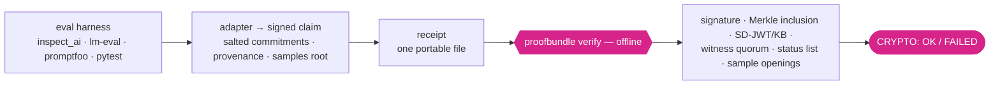

<div align="center">

<picture>
  <source media="(prefers-color-scheme: dark)" srcset="https://raw.githubusercontent.com/b7n0de/proofbundle/main/assets/b7n0de-hase-logo-dark.png">
  
</picture>

<h1>proofbundle</h1>

**AI eval results need receipts.**

Turn an AI evaluation result into one portable, offline-verifiable receipt. It proves *who signed
these exact bytes* and *that nothing changed since* — not that the number is true. Ed25519 + RFC 6962
Merkle, one file, no server, no network.

[](https://github.com/b7n0de/proofbundle/actions/workflows/ci.yml)
[](https://github.com/b7n0de/proofbundle/actions/workflows/demo-reproducible.yml)
[](https://pypi.org/project/proofbundle/)
[](https://pypi.org/project/proofbundle/)
[](https://github.com/b7n0de/proofbundle/blob/main/LICENSE)
[](https://doi.org/10.5281/zenodo.21110642)
[](https://github.com/astral-sh/ruff)
[](https://github.com/b7n0de/proofbundle/blob/main/scripts/mutation_check.py)
[](https://pypi.org/project/proofbundle/#files)
[](https://slsa.dev/spec/v1.0/provenance)

**Reviewing this for adoption?** Start with the 30-minute adversarial audit path: **[docs/REVIEWERS.md](https://github.com/b7n0de/proofbundle/blob/main/docs/REVIEWERS.md)**.

</div>

## Contents

- [60-second try](#60-second-try-offline)
- [Inspect-native?](#inspect-native-metr-task-standard-uk-aisi-ecosystem)
- [The problem](#the-problem)
- [What a receipt proves, and what it doesn't](#what-a-receipt-proves-and-what-it-doesnt)
- [How it fits together](#how-it-fits-together)
- [Cite this work](#cite-this-work)
- [Post-quantum posture](#post-quantum-posture-honest-two-layers)
- [What's in the box](#whats-in-the-box)
- [Docs](#docs)
- [Install](#install)
- [Status, scope and roadmap](#status-scope-and-roadmap)
- [Contributing](#contributing)
- [License](#license)

## 60-second try (offline)

```bash
pip install "proofbundle[eval]"
proofbundle demo   # honest receipt => OK, six tampers each => FAILED, sample swap caught
# Inspect-native (METR Task Standard / UK-AISI ecosystem, mockllm, no API key):
git clone https://github.com/b7n0de/proofbundle && cd proofbundle
pip install -e ".[eval,inspect]" && make demo   # or `make full-demo` for log -> receipt -> verify
```

The demo runs entirely in memory: an honest receipt verifies `=> OK`, six independent tampers each
verify `FAILED`, and a swapped sample gets caught. `proofbundle demo` exits non-zero if any tamper
slips through, so it doubles as a self-test. Full walkthrough: **[docs/DEMO.md](https://github.com/b7n0de/proofbundle/blob/main/docs/DEMO.md)**.

```bash
# verify a real hosted receipt without writing any code:
curl -fsSL https://raw.githubusercontent.com/b7n0de/proofbundle/main/examples/example_bundle.json -o receipt.json
proofbundle verify receipt.json        # CRYPTO: OK  (the verify itself runs fully offline)

# your own receipt, from a signed payload:
proofbundle emit --payload-file result.json --new-key signer.key --out receipt.json
proofbundle verify receipt.json        # exit 0 = crypto OK, 1 = crypto/verification failure, 2 = malformed

# apply YOUR trust decision — verify makes NO trust decision on its own:
proofbundle verify receipt.json --policy trust_policy.json   # POLICY: OK | FAIL (exit 3) | NOT_EVALUATED

# start from a shipped TEMPLATE and pin your own signer — offline, no network:
proofbundle policy instantiate strict-eval-template-v1 \
  --issuer-key org-eval.pub --policy-id org/strict-eval-v1 --output org.json
proofbundle verify receipt.json --json --policy org.json \
  --expected-root <b64> --expected-tree-size <n>   # or: --trusted-checkpoint note.txt --checkpoint-vkey <vkey>
# → root_authenticity.safeForAutomation: true only when the policy pins a trusted signer AND root
#   plus tree size are authenticated ATOMICALLY from one source (a root-bytes-only pin is
#   rootTrustLevel: ROOT_BYTES_ONLY — never automation-safe; automationBlockers names every reason)
```

## Inspect-native? (METR Task Standard, UK-AISI ecosystem)

The receipt layer runs directly on [Inspect AI](https://inspect.aisi.org.uk/) — and the proof is
reproducible offline in minutes:

```bash
# setup as in the 60-second try above (clone + pip install -e ".[eval,inspect]"), then:
make full-demo   # a genuine inspect_ai eval log (mockllm: offline, no API key, no GPU)
                 # -> signed receipt next to the log -> proofbundle verify => OK
```

In your own pipeline the end-of-task hook signs every run automatically. Walkthrough:
**[docs/INSPECT_HAPPY_PATH.md](https://github.com/b7n0de/proofbundle/blob/main/docs/INSPECT_HAPPY_PATH.md)** · worked example:
**[examples/inspect_receipt.py](https://github.com/b7n0de/proofbundle/blob/main/examples/inspect_receipt.py)**.

## The problem

Every AI eval number you read — a safety benchmark, a capability score, a leaderboard entry — is an
**unverifiable claim**. You trust the lab. There's no portable way to check, offline, that a result
was signed by a stated party, hasn't been altered, and covers the samples it claims.

proofbundle is that check. It's a small MIT-licensed Python tool (a compact, auditable trusted core,
depends only on [`cryptography`](https://cryptography.io)) that turns a result into a signed
receipt anyone can verify from a single file — and it's honest about the line it does not cross.

In plain language: a proofbundle receipt is the cash-register receipt of an AI test result. It shows
who claimed the number and that nobody quietly changed it afterwards. It does not show the test was
good — the way a cash-register receipt does not show the meal was good — but without a receipt there
is nothing to check at all.

## What a receipt proves, and what it doesn't

| ✅ It proves | ❌ It does **not** prove |
|---|---|
| These exact bytes were signed by this key (**authorship**) | That the number is **true** |
| Nothing changed since signing (**integrity**, Ed25519 + RFC 6962) | That the **issuer is honest** |
| The result is attributable to a stated issuer | That the **eval was well-designed** |
| A threshold was met while hiding the model/dataset (salted commitments) | That there was **no cherry-picking** — unless pre-registered |
| Optionally: individual samples, offline-auditable (per-sample Merkle) | That the **computation was correct** — that needs a TEE or independent reproduction |

This boundary is the point, not a weakness. A receipt makes a claim **attributable, tamper-evident,
and — with pre-registration and per-sample auditing — bounded and spot-checkable**. Full detail:
**[THREAT_MODEL.md](https://github.com/b7n0de/proofbundle/blob/main/THREAT_MODEL.md)**.

## How it fits together

*(diagram renders on GitHub — [view it there](https://github.com/b7n0de/proofbundle#how-it-fits-together); PyPI shows the source)*



### Where it sits in the research neighbourhood

proofbundle is a **practical, released, offline verifier — complementary to TEE and zero-knowledge
approaches**, not a replacement for any of them. It is honest about the line each neighbour crosses
that a receipt does not. Maturity labels are stated so nothing reads as a settled standard when it is
a preprint.

| Neighbour | What it contributes that a receipt does not | Maturity | Where proofbundle draws the line |
|---|---|---|---|
| **K-Veritas** ([arXiv 2605.08586](https://arxiv.org/abs/2605.08586)) — nonrepudiable experimental results | the academic case for tamper-evident, execution-bound experiment reports | preprint | proofbundle is a released, offline, eval-shaped receipt for exactly this problem, not the only take on it |
| **Attestable Audits** ([arXiv 2506.23706](https://arxiv.org/abs/2506.23706)) — TEE-verified safety audits | that the computation actually ran, inside a trusted enclave | preprint (research prototype) | a receipt proves authorship + integrity, **not** that the computation was correct — that needs a TEE or independent reproduction |
| **BenchJack** ([arXiv 2605.12673](https://arxiv.org/abs/2605.12673)) — auditing agent benchmarks | whether the benchmark itself is gameable (reward-hacking) | preprint | a receipt over a gameable benchmark is honestly still just a receipt; it says nothing about whether the eval was well designed |
| **Evaluation Cards** ([arXiv 2606.09809](https://arxiv.org/abs/2606.09809)) — reporting / interpretation layer | a structured, human-facing account of what a result means | preprint | a receipt can bind a card's integrity (`evaluation_card_sha256`, EVAL_CLAIM.md), not its quality |
| in-toto / Sigstore, SCITT / Rekor v2, OpenSSF Model Signing (stable standards / production) | artifact-provenance, public transparency, model-artifact signing | — | see [INTEROP.md](https://github.com/b7n0de/proofbundle/blob/main/INTEROP.md) for the honest tool-by-tool comparison |

## Cite this work

If proofbundle helped your evaluation pipeline, please cite it. Machine-readable metadata is in
[`CITATION.cff`](https://github.com/b7n0de/proofbundle/blob/main/CITATION.cff). The archival software record
is on Zenodo under concept DOI [10.5281/zenodo.21110642](https://doi.org/10.5281/zenodo.21110642); the
Technical Note (design write-up) under concept DOI
[10.5281/zenodo.21230466](https://doi.org/10.5281/zenodo.21230466), also linked from
[b7n0de.com/proofbundle](https://b7n0de.com/proofbundle).

## Post-quantum posture (honest, two layers)

proofbundle is **not** "quantum-proof" or "quantum-safe" as a whole. It combines two cryptographic layers
with very different quantum exposure, and it is honest about both:

- **Quantum-robust (hash-based)** — SHA-256, RFC 6962 / 9162 Merkle inclusion, RFC 8785 canonicalization,
  and, among the external time anchors, the OpenTimestamps (Bitcoin hash-chain) and `chia-datalayer/v1`
  (Merkle inclusion) types. Grover only halves the effective bit-strength (SHA-256 keeps a ~128-bit quantum
  margin, which NIST currently treats as adequate), so these stay secure.
- **Quantum-vulnerable (elliptic-curve / classical PKI, Shor)** — the Ed25519 receipt signature; for the
  `chia-datalayer` anchor, Chia's BLS12-381 wallet layer; and, for the RFC 3161 anchor, the TSA's own
  classical (RSA/ECDSA) certificate-chain signature. A large enough quantum computer could forge any of these.

The attack that matters is not decryption but **back-dated forgery**: an attacker with a quantum computer
could mint a fake signature on a tampered receipt. The defense — **when a receipt carries a hash-based time
anchor** (optional, the `[anchors]` beta extra: OpenTimestamps or `chia-datalayer`) — is that the anchor
proves the original receipt existed *before* that capability, so a forged receipt has no matching anchor.
That protects the evidence long-term even if the signature layer later breaks. A plain receipt with no anchor
does not carry this property.

On the witness side, C2SP checkpoints already carry post-quantum **ML-DSA-44** (FIPS 204) cosignatures
(`proofbundle[pq]`); a post-quantum *payload* signature — crypto-agility for the receipt itself — is on the
roadmap.

## What's in the box

- **Core** — Ed25519 signature + RFC 6962 / 9162 Merkle inclusion, verified fully offline. Checks a
  real [Sigstore Rekor](https://docs.sigstore.dev/) proof, so correctness isn't self-referential.
- **Eval receipts** — a signed claim (`metric ⋈ threshold`, `n`, salted model/dataset commitments,
  assurance level, provenance) from your run. See [EVAL_CLAIM.md](https://github.com/b7n0de/proofbundle/blob/main/EVAL_CLAIM.md).
- **Selective disclosure** — SD-JWT ([RFC 9901](https://datatracker.ietf.org/doc/rfc9901/)) with Key
  Binding: prove a threshold while withholding the exact score. Secure-by-default in 3.0.0 (breaking): an
  unsigned SD-JWT, or one whose disclosures do not bind this bundle, now fails verification (was warn-only).
- **Transparency-log interop** — C2SP `tlog-checkpoint` / cosignature / `.tlog-proof`, with
  post-quantum **ML-DSA-44** witness cosignatures. Optional Token-Status-List revocation snapshots.
- **Per-sample audit** — commit to every sample; an auditor challenges random indices (with a fresh
  nonce or a **public randomness beacon**, v1.9) and openings must bind to the signed root. With
  such an auditor-supplied or beacon-bound challenge, 300 samples catch 1% sample-doctoring with 95%
  confidence, regardless of run size — a challenge the issuer chose itself does not give this
  guarantee.
- **Pre-registration** — `proofbundle prereg <plan>` commits to the protocol before the run, so
  best-of-many publishing becomes visible.
- **Integrations** — opt-in inspect_ai end-of-task hook and pytest plugin (emit only when
  `PROOFBUNDLE_EMIT=1` / `--proofbundle`), plus a Hugging Face Community Evals bridge. See
  [INTEGRATIONS.md](https://github.com/b7n0de/proofbundle/blob/main/INTEGRATIONS.md), or the end-to-end walkthrough
  [docs/INSPECT_HAPPY_PATH.md](https://github.com/b7n0de/proofbundle/blob/main/docs/INSPECT_HAPPY_PATH.md) — run an eval, get a receipt, verify it offline.
- **External time anchors** *(v2.0 beta, the `[anchors]` extra)* — an optional `anchors[]` layer that
  attaches external evidence of *when* a commitment or receipt existed, from a party the producer does not
  control. Two built-in types verify offline: **RFC 3161** TSA tokens (against a relying-party-supplied TSA
  root, see the 3.0.0 trust note below) and **OpenTimestamps** Bitcoin proofs (honest pending → confirmed lifecycle). A `register_anchor_type`
  extension interface lets a third party ship its own fail-closed type; two worked examples ship — a
  first-party **`chia-datalayer/v1`** (offline Merkle inclusion of a canonical root under a published Chia
  DataLayer root) and a third-party **`markovian-provenance/v1`** (a wallet-attributable, Bitcoin-anchored
  stamp). **Since 2.1:** a `verify --require-anchor` relying-party gate (optionally narrowed by
  `--anchor-type`) turns "no verifying anchor of that type" into a failure layered over the crypto result
  (exit 3, like `--policy`); a pending anchor does not satisfy it unless `--allow-pending`. Plus RFC 3161
  hardening — the frozen cert chain is validated at the token's own `gen_time`, with optional `policyOid`
  pinning. **Breaking in 3.0.0:** an anchor's TRUST now comes only from the relying party — supply a TSA
  root (`--trusted-tsa-root`) or a Bitcoin block header (`--bitcoin-header`), or the equivalent `anchors`
  policy keys; the bundle's producer-controlled `frozen` block is evidence, never a trust source, so
  `--require-anchor` without relying-party trust material is unmet (exit 3). An anchor stays detached from
  the content root, and the `statement` target is RESERVED for decision receipts.
  See [docs/ANCHORS.md](https://github.com/b7n0de/proofbundle/blob/main/docs/ANCHORS.md).
- **Universal content root** *(2.1, `jcs-sha256-v1`, [ADR 0002](https://github.com/b7n0de/proofbundle/blob/main/docs/adr/0002-universal-content-root.md))* — one shared primitive now underlies both the
  decision-receipt path and the in-toto eval-result / test-result / SVR exports: SHA-256 over the RFC 8785
  (JCS) canonical bytes of the full pre-signature Statement, so a content root survives counter-signing and
  key rotation. The algorithm is a versioned id signed inside the payload (`contentRootAlg`, default
  `jcs-sha256-v1`); a verifier re-serializes with exactly the declared algorithm, never falls back, and an
  unknown algorithm fails closed. Migration is a compatible evolution, not a cutover: absent `contentRootAlg`
  ⇒ the historic `legacy-sortkeys-json-v0` mode, so every already-signed 2.0.0 receipt keeps verifying
  byte-for-byte. This is **not** a completed universal migration — a CLI flag to select the algorithm is still
  deferred. Independent cross-implementation (MarkovianProtocol) interop is now proven for RFC 8785
  canonicalization + content-root binding (see `conformance/decision/crossimpl/`); the same corpus additionally
  verifies a confirmed Bitcoin anchor (block 957504) offline. The external fixture currently reports 12 findings
  against the enforced `decision-receipt/v0.1` validator — recorded as an expected-fail, not hidden — so full
  schema conformance awaits a further schema-conformant regeneration.
- **Decision Receipts** *(2.1, vendored `decision-receipt/v0.1` predicate)* — a separate predicate for agent
  *decisions* (not eval metrics): who decided, the proposed action, the policy boundary, digest-bound evidence,
  the verdict (`ALLOW`/`DENY`/`REFUSE`/`ESCALATE`/`DEFER`/`OBSERVE`), and explicitly what was *not* checked.
  `proofbundle decision emit|verify` with a v0.2 trust policy (`trusted_decision_makers`, `accepted_predicate_
  types`). An eval receipt says *the number is authored and intact*; a Decision Receipt says *this decision was
  made by this gate over this evidence* — never that the decision was correct. `actionOutcome=executed` without
  a signed outcome is self-assertion. See
  [docs/predicates/decision-receipt.md](https://github.com/b7n0de/proofbundle/blob/main/docs/predicates/decision-receipt.md)
  and [ADR 0001](https://github.com/b7n0de/proofbundle/blob/main/docs/adr/0001-decision-receipt-separate-predicate.md).
  That signed outcome is the `action-outcome/v0.1` predicate (EXPERIMENTAL, 3.2.0): an executor signs what was
  actually done, bound by content root to the Decision Receipt, with role separation (executor ≠ decision maker)
  and `execution_proven` only when an effect digest backs an `executed` status. See
  [docs/predicates/action-outcome.md](https://github.com/b7n0de/proofbundle/blob/main/docs/predicates/action-outcome.md).

## Docs

| For… | Read |
|---|---|
| Skeptics (why not SHA-256 / Sigstore / trust the issuer) | [docs/FAQ.md](https://github.com/b7n0de/proofbundle/blob/main/docs/FAQ.md) |
| New to this? plain-terms glossary | [docs/GLOSSARY.md](https://github.com/b7n0de/proofbundle/blob/main/docs/GLOSSARY.md) |
| Reviewers (30-minute adversarial audit path) | [docs/REVIEWERS.md](https://github.com/b7n0de/proofbundle/blob/main/docs/REVIEWERS.md) |
| Where every trust anchor comes from | [docs/TRUST_ANCHORS.md](https://github.com/b7n0de/proofbundle/blob/main/docs/TRUST_ANCHORS.md) |
| The demos, tier by tier | [docs/DEMO.md](https://github.com/b7n0de/proofbundle/blob/main/docs/DEMO.md) |
| The normative format + verification order | [SPEC.md](https://github.com/b7n0de/proofbundle/blob/main/SPEC.md) |
| Honest comparison to Rekor / in-toto / OMS / ValiChord | [INTEROP.md](https://github.com/b7n0de/proofbundle/blob/main/INTEROP.md) |
| Regulatory mapping (and what to never claim) | [COMPLIANCE.md](https://github.com/b7n0de/proofbundle/blob/main/COMPLIANCE.md) |
| Funders / role fit | [docs/PROJECT_BRIEF.md](https://github.com/b7n0de/proofbundle/blob/main/docs/PROJECT_BRIEF.md) |
| External time anchors + the bring-your-own-type extension interface (v2.0 beta) | [docs/ANCHORS.md](https://github.com/b7n0de/proofbundle/blob/main/docs/ANCHORS.md) |
| **Preview:** TEE-attestation bridge (v2.0 beta) | [docs/EXPERIMENTAL_ENCLAVE.md](https://github.com/b7n0de/proofbundle/blob/main/docs/EXPERIMENTAL_ENCLAVE.md) |

## Install

```bash
pip install proofbundle                 # core: offline verify + plain emit (dependency-free)
pip install "proofbundle[eval]"          # + eval receipts, prereg, and the demo (adds an RFC 8785 JCS canonicalizer)
pip install "proofbundle[inspect]"      # inspect_ai adapter + hook
pip install "proofbundle[pq]"           # verify ML-DSA-44 (post-quantum) witness cosignatures
```

Requires Python 3.10+. The verify path never rolls its own crypto — Ed25519 comes from
`cryptography`; Merkle hashing is RFC 6962.

## Status, scope and roadmap

Beta, SemVer-committed, with a CI test suite behind a mutation gate + property-based parser fuzzing. Correctness
is anchored to external RFC 6962 vectors and a real Rekor proof, not just its own bundles. It is
**not** a log service, a full in-toto client, a TEE, a consensus network, or a compliance product
by itself — it is the small, offline, standards-native receipt layer between them. Security policy:
[SECURITY.md](https://github.com/b7n0de/proofbundle/blob/main/SECURITY.md).

**Roadmap (stated honestly, not yet built):**

- A post-quantum *payload* signature (crypto-agility for the receipt itself) is on the roadmap; today the
  post-quantum coverage is witness-side ML-DSA-44 cosignatures only.
- A CLI flag to select the content-root algorithm is still deferred (`jcs-sha256-v1` is the signed default).

**Already shipped, preview/experimental maturity (not on the roadmap above — built, tested, install
extra `[experimental]`, but API/wire-format may still change without deprecation):**

- A TEE-attestation bridge (RATS/EAT, RFC 9334 + RFC 9711) that makes `assurance_level =
  enclave_attested` independently verifiable — see [docs/EXPERIMENTAL_ENCLAVE.md](https://github.com/b7n0de/proofbundle/blob/main/docs/EXPERIMENTAL_ENCLAVE.md).

## Contributing

See [CONTRIBUTING.md](https://github.com/b7n0de/proofbundle/blob/main/CONTRIBUTING.md) and the [Code of Conduct](https://github.com/b7n0de/proofbundle/blob/main/CODE_OF_CONDUCT.md). Good first
issues are labeled [`good-first-issue`](https://github.com/b7n0de/proofbundle/labels/good-first-issue);
security findings go through [SECURITY.md](https://github.com/b7n0de/proofbundle/blob/main/SECURITY.md). The verifier core aims to stay small,
dependency-light, and correct.

## License

MIT — see [LICENSE](https://github.com/b7n0de/proofbundle/blob/main/LICENSE).

---

<p align="center"><sub>proofbundle is part of <b>b7n0de</b>, Verified AI Work · <a href="https://b7n0de.com">b7n0de.com</a></sub></p>
