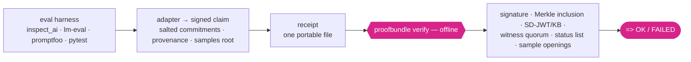

<div align="center">

<picture>
  <source media="(prefers-color-scheme: dark)" srcset="assets/b7n0de-logo-dark.svg">
  
</picture>

<h1>proofbundle</h1>

**Turn an AI eval result into one portable, offline-verifiable receipt.**
It proves *who signed these exact bytes* and *that nothing changed since* — not that the number is
true. Ed25519 + RFC 6962 Merkle, one file, no server, no network.

[](https://github.com/b7n0de/proofbundle/actions/workflows/ci.yml)
[](LICENSE)
[](https://github.com/astral-sh/ruff)
[](scripts/mutation_check.py)
<!-- PyPI / Downloads / SLSA / PEP 740 badges are enabled on the first PyPI release — see RELEASE.md. -->

</div>

## The problem

Every AI eval number you read — a safety benchmark, a capability score, a leaderboard entry — is an
**unverifiable claim**. You trust the lab. There's no portable way to check, offline, that a result
was signed by a stated party, hasn't been altered, and covers the samples it claims.

proofbundle is that check. It's a small MIT-licensed Python tool (a compact, auditable trusted core,
depends only on [`cryptography`](https://cryptography.io)) that turns a result into a signed
receipt anyone can verify from a single file — and it's honest about the line it does not cross.

## 60-second try (offline, no setup)

```bash
pip install "proofbundle[eval]"
proofbundle demo
```

You'll see an honest receipt verify `=> OK`, then six independent tampers each verify `FAILED`, then
a swapped sample get caught — all in memory. The command exits non-zero if any tamper slips through,
so it's also a self-test. Full walkthrough: **[docs/DEMO.md](docs/DEMO.md)**.

```bash
# your own receipt, from a signed payload:
proofbundle emit --payload-file result.json --new-key signer.key --out receipt.json
proofbundle verify receipt.json        # exit 0 = OK, 1 = failed, 2 = malformed
```

## What a receipt proves — and what it doesn't

| ✅ It proves | ❌ It does **not** prove |
|---|---|
| These exact bytes were signed by this key (**authorship**) | That the number is **true** |
| Nothing changed since signing (**integrity**, Ed25519 + RFC 6962) | That the **issuer is honest** |
| The result is attributable to a stated issuer | That the **eval was well-designed** |
| A threshold was met while hiding the model/dataset (salted commitments) | That there was **no cherry-picking** — unless pre-registered |
| Optionally: individual samples, offline-auditable (per-sample Merkle) | That the **computation was correct** — that needs a TEE or independent reproduction |

This boundary is the point, not a weakness. A receipt makes a claim **attributable, tamper-evident,
and — with pre-registration and per-sample auditing — bounded and spot-checkable**. Full detail:
**[THREAT_MODEL.md](THREAT_MODEL.md)**.

## How it fits together



## What's in the box

- **Core** — Ed25519 signature + RFC 6962 / 9162 Merkle inclusion, verified fully offline. Checks a
  real [Sigstore Rekor](https://docs.sigstore.dev/) proof, so correctness isn't self-referential.
- **Eval receipts** — a signed claim (`metric ⋈ threshold`, `n`, salted model/dataset commitments,
  assurance level, provenance) from your run. See [EVAL_CLAIM.md](EVAL_CLAIM.md).
- **Selective disclosure** — SD-JWT ([RFC 9901](https://datatracker.ietf.org/doc/rfc9901/)) with Key
  Binding: prove a threshold while withholding the exact score.
- **Transparency-log interop** — C2SP `tlog-checkpoint` / cosignature / `.tlog-proof`, with
  post-quantum **ML-DSA-44** witness cosignatures. Optional Token-Status-List revocation snapshots.
- **Per-sample audit** — commit to every sample; an auditor challenges random indices (with a fresh
  nonce or a **public randomness beacon**, v1.9) and openings must bind to the signed root. Catches
  1% sample-doctoring with 95% confidence at 300 samples, regardless of run size.
- **Pre-registration** — `proofbundle prereg <plan>` commits to the protocol before the run, so
  best-of-many publishing becomes visible.
- **Integrations** — opt-in inspect_ai end-of-task hook and pytest plugin (emit only when
  `PROOFBUNDLE_EMIT=1` / `--proofbundle`), plus a Hugging Face Community Evals bridge. See
  [INTEGRATIONS.md](INTEGRATIONS.md).

## Docs

| For… | Read |
|---|---|
| Skeptics (why not SHA-256 / Sigstore / trust the issuer) | [docs/FAQ.md](docs/FAQ.md) |
| New to this? plain-terms glossary | [docs/GLOSSARY.md](docs/GLOSSARY.md) |
| Reviewers (30-minute adversarial audit path) | [docs/REVIEWERS.md](docs/REVIEWERS.md) |
| Where every trust anchor comes from | [docs/TRUST_ANCHORS.md](docs/TRUST_ANCHORS.md) |
| The demos, tier by tier | [docs/DEMO.md](docs/DEMO.md) |
| The normative format + verification order | [SPEC.md](SPEC.md) |
| Honest comparison to Rekor / in-toto / OMS / ValiChord | [INTEROP.md](INTEROP.md) |
| Regulatory mapping (and what to never claim) | [COMPLIANCE.md](COMPLIANCE.md) |
| Funders / role fit | [docs/PROJECT_BRIEF.md](docs/PROJECT_BRIEF.md) |
| **Preview:** TEE-attestation bridge (v2.0 beta) | [docs/EXPERIMENTAL_ENCLAVE.md](docs/EXPERIMENTAL_ENCLAVE.md) |

## Install

```bash
pip install proofbundle                 # core: offline verify + plain emit (dependency-free)
pip install "proofbundle[eval]"          # + eval receipts, prereg, and the demo (adds an RFC 8785 JCS canonicalizer)
pip install "proofbundle[inspect]"      # inspect_ai adapter + hook
pip install "proofbundle[pq]"           # verify ML-DSA-44 (post-quantum) witness cosignatures
```

Requires Python 3.10+. The verify path never rolls its own crypto — Ed25519 comes from
`cryptography`; Merkle hashing is RFC 6962.

## Status & scope

Beta, SemVer-committed, 303 tests + a CI mutation gate + property-based parser fuzzing. Correctness
is anchored to external RFC 6962 vectors and a real Rekor proof, not just its own bundles. It is
**not** a log service, a full in-toto client, a TEE, a consensus network, or a compliance product
by itself — it is the small, offline, standards-native receipt layer between them. Security policy:
[SECURITY.md](SECURITY.md).

## Contributing

See [CONTRIBUTING.md](CONTRIBUTING.md) and the [Code of Conduct](CODE_OF_CONDUCT.md). Good first
issues are labeled [`good-first-issue`](https://github.com/b7n0de/proofbundle/labels/good-first-issue);
security findings go through [SECURITY.md](SECURITY.md). The verifier core aims to stay small,
dependency-light, and correct.

## License

MIT — see [LICENSE](LICENSE).

---

<p align="center"><sub>proofbundle is part of <b>b7n0de</b>, Verified AI Work · <a href="https://b7n0de.com">b7n0de.com</a></sub></p>
